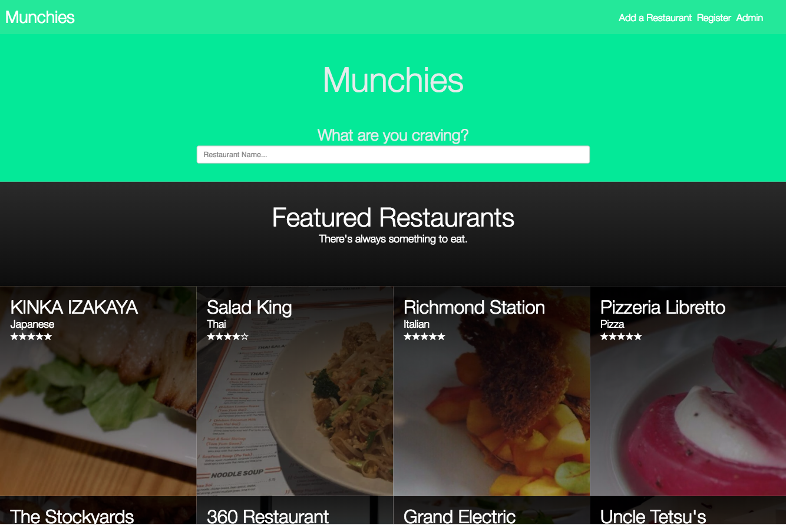

# munchies-react
The munchies app front end repo. Relies on munchies-python for api and data retrieval.

The application was developed by myself and Pasoon Azimi for our Database course. Given a set of requirements for a database we were instructed to create a front end that would query data from the database and show the user. Although a robust front end was not required it was a great way for me to learn React development so we decided to build this.

Some screenshots of the final application:

  

   

# More details

The project is called Munchies, a restaurant app. It is separated into 2 parts. The front end is in the munchies-react folder, a react app we made. And the back end is in the munchies-python folder which is a python app we made to act as our API. The API uses Flask to connect to Postgres server and query on our databases.

If you want to run the application on your machine you will need a empty postgres database to work with. Run the app.py script with the create_all() uncommented out, and each of the populate functions one at a time. So uncomment populateRestaurants(), then run app.py. Comment populateRestauarants, and uncomment the next one and run app.py. 

The populate funtions are scraping Zomatio api to gather restaurant and data for the database. 

The front end can be run be navigation to the directory munchies-react. Once in the directory in terminal run npm-install, wait till finished. Once finished you need to run webpack build command. Then navigate to the /src directory, and run live-server. THe app should run, make you the app.py is also running to access the api.
